# **Лабораторная работа. Просмотр таблицы MAC-адресов коммутатора**       
## **Задание**   
### **Часть 1. Создание и настройка сети**   
### **Часть 2. Изучение таблицы МАС-адресов коммутатора**     

## **Часть 1. Создание и настройка сети**   
### **Шаг 1. Подключите сеть в соответствии с топологией**   
#### Подключаем консольный кабель    

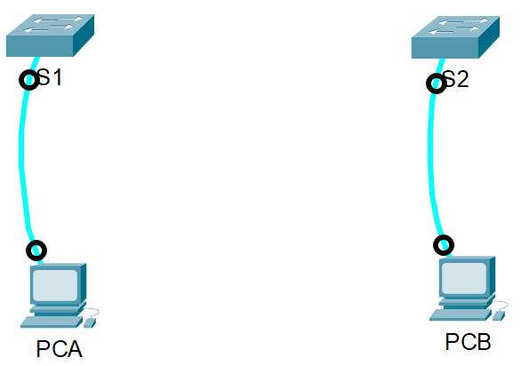     
#### Присоединяем кабель Ethernet к устройствам   
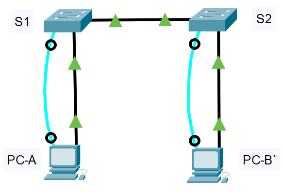      
#### Проверяем включены ли интерфейсы на коммутаторах    
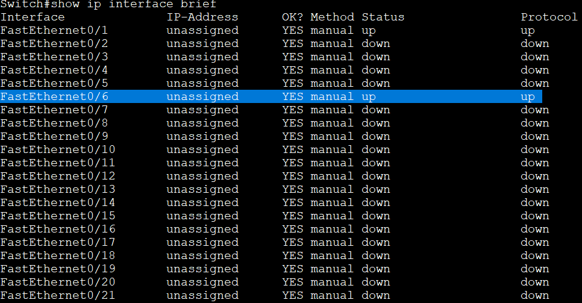    

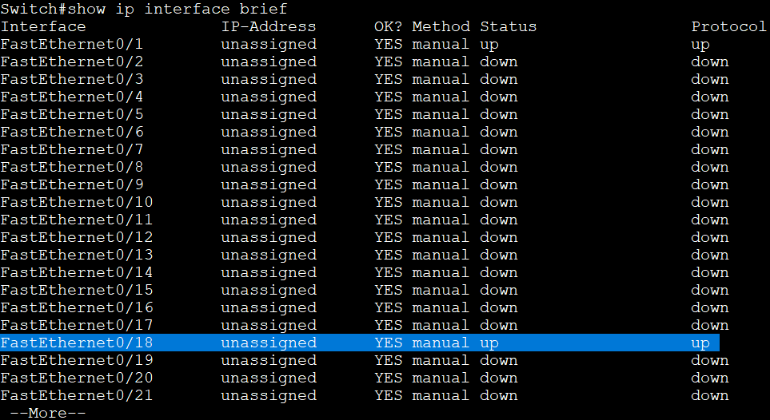      

### **Шаг 2. Настройте узлы ПК.**  
#### Настраиваем IP-адреса на ПК   
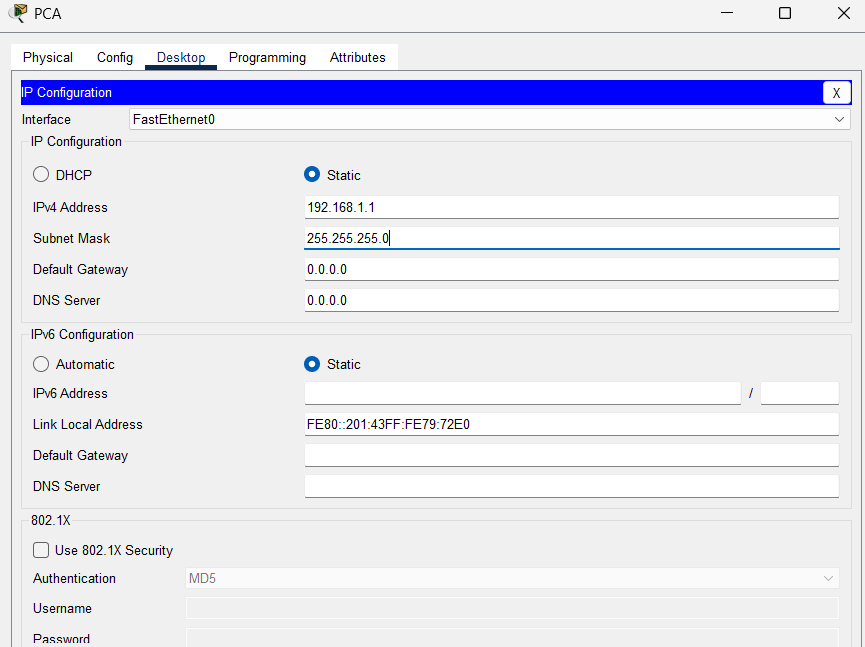       

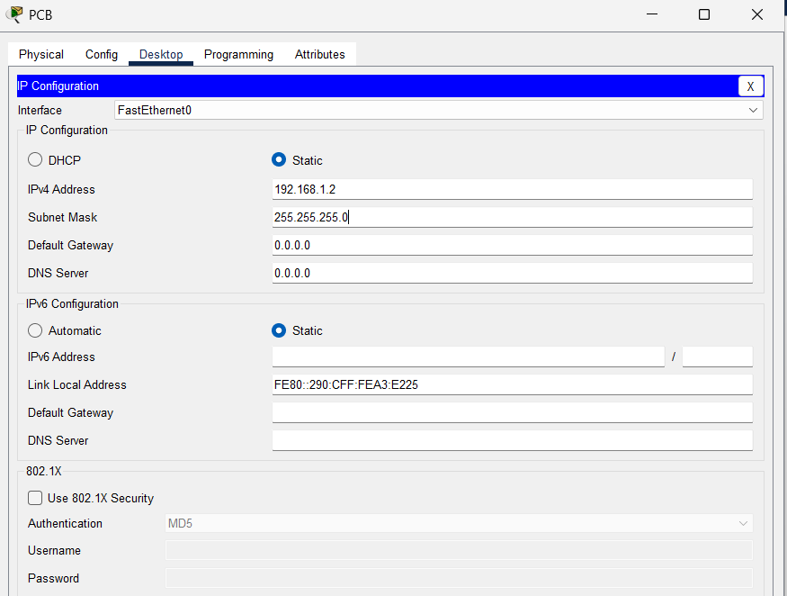   

### **Шаг 3. Выполните инициализацию и перезагрузку коммутаторов.**   
#### На коммутаторе 1 вводим последовательно команды:
#### **enable** - вход в привелиигированный режим;  
#### **copy running-config startup-config** - сохраняет текущую конфигурацию    
#### **erase startup-config** - удаляет текущую конфигурацию, сохраненную в энергозависимой памяти (NVRAM);  
#### **reload** - Коммутатор начнет процесс перезагрузки.  
#### Повторяем процедуру для коммутатора 2   

### **Шаг 4. Настройте базовые параметры каждого коммутатора.** 
#### a.	Настройте имена устройств в соответствии с топологией.  
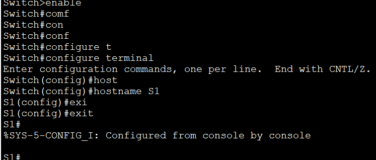     

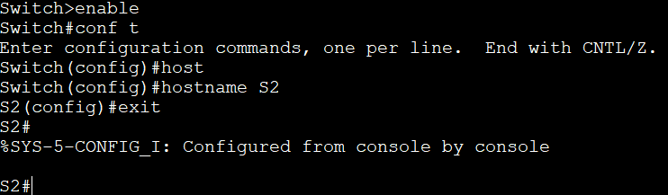       

#### b.	Настройте IP-адреса, как указано в таблице адресации.   
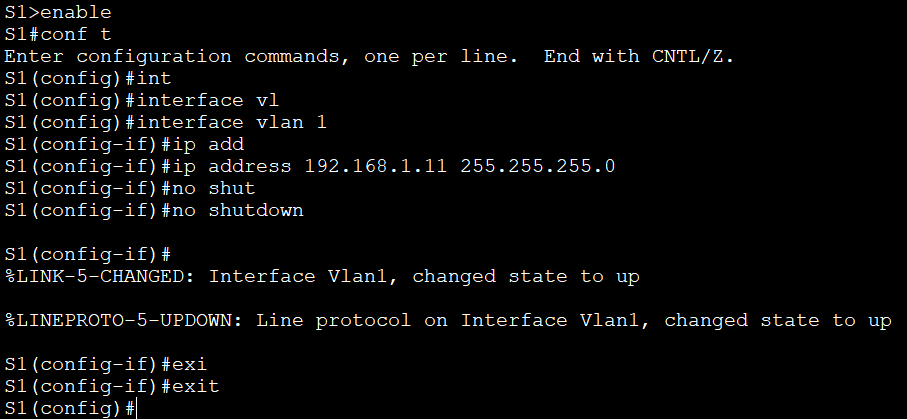     

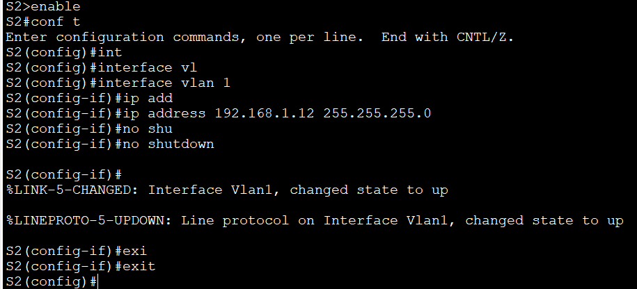      

#### c.	Назначьте cisco в качестве паролей консоли и VTY. 
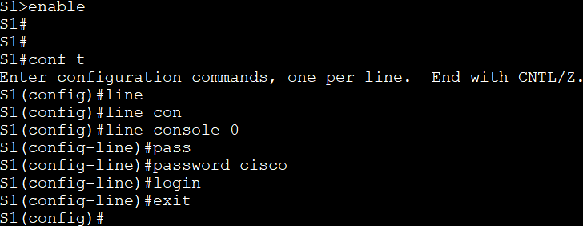       
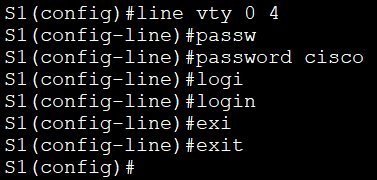        
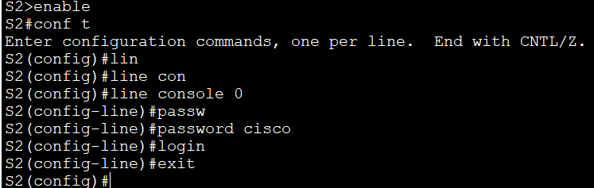         
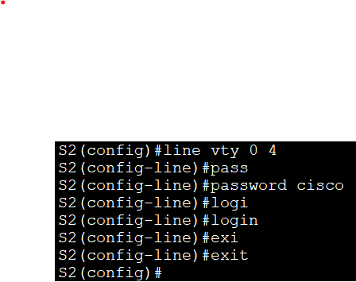  

#### d.	Назначьте class в качестве пароля доступа к привилегированному режиму EXEC.  
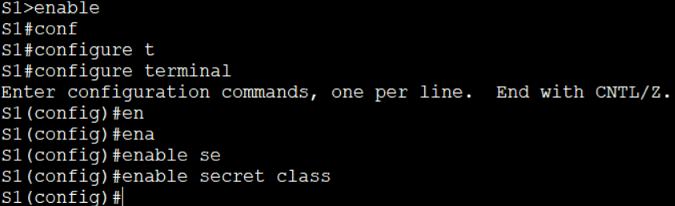 
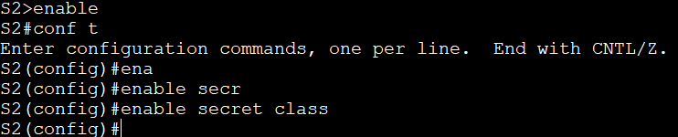 
#### Сохраняем параметры конфигурации 
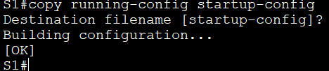 
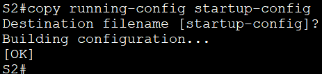 

## **Часть 2. Изучение таблицы МАС-адресов коммутатора** 
#### a.	Откройте командную строку на PC-A и PC-B и введите команду **ipconfig /all**. 
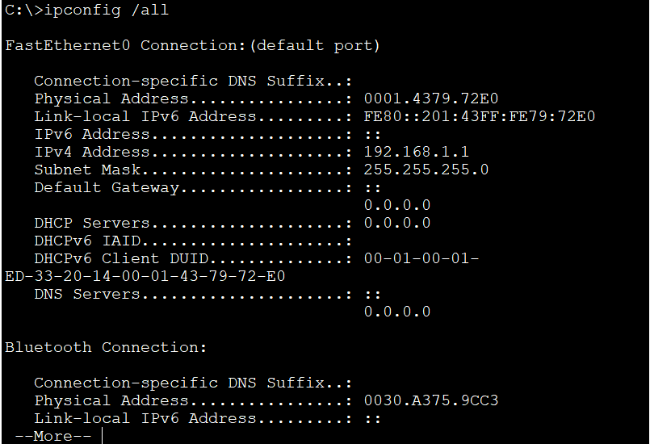 
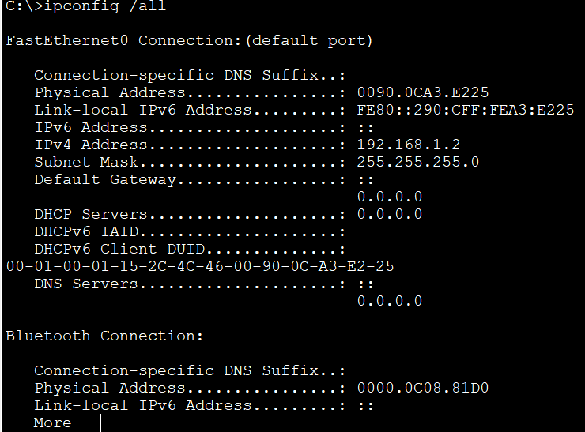 
#### Назовите физические адреса адаптера Ethernet.
#### MAC-адрес компьютера PC-A:0001.4379.72E0  
#### MAC-адрес компьютера PC-B:0090.0CA3.E225 
#### b.	Подключитесь к коммутаторам S1 и S2 через консоль и введите команду show interface F0/1 на каждом коммутаторе.  
 
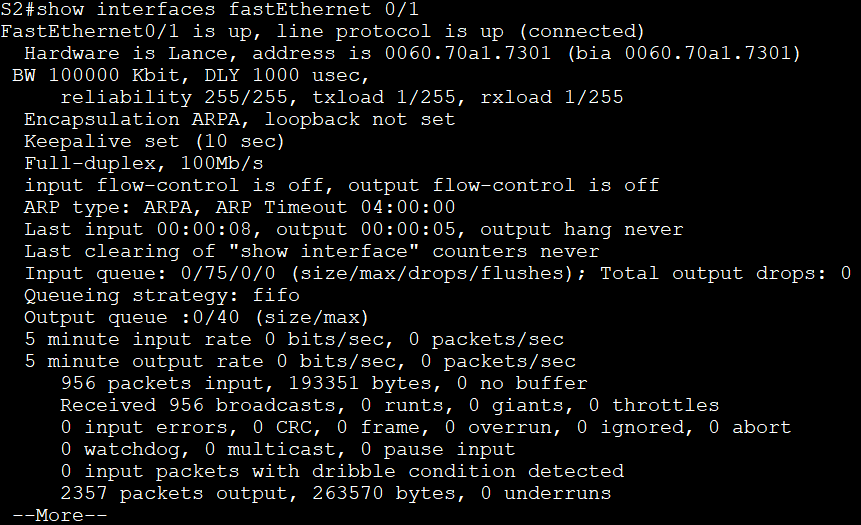 
#### Назовите адреса оборудования во второй строке выходных данных команды (или зашитый адрес — bia). 
#### МАС-адрес коммутатора S1 Fast Ethernet 0/1: 00d0.ba88.1b01 (bia 00d0.ba88.1b01) 
#### МАС-адрес коммутатора S2 Fast Ethernet 0/1: 0060.70a1.7301 (bia 0060.70a1.7301) 

### **Шаг 2. Просмотрите таблицу МАС-адресов коммутатора.** 
#### a.	Подключитесь к коммутатору S2 через консоль и войдите в привилегированный режим EXEC. 
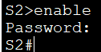 
#### b.	В привилегированном режиме EXEC введите команду **show mac address-table** и нажмите клавишу ввода.  
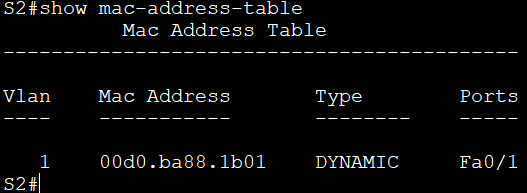 
#### Записаны ли в таблице МАС-адресов какие-либо МАС-адреса? 
#### Да, записаны. 
#### Какие МАС-адреса записаны в таблице? С какими портами коммутатора они сопоставлены и каким устройствам принадлежат? Игнорируйте МАС-адреса, сопоставленные с центральным процессором. 
#### В Vlan 1 имеется MAC-адрес интерфейса Fa0/1. 
#### Если вы не записали МАС-адреса сетевых устройств в шаге 1, как можно определить, каким устройствам принадлежат МАС-адреса, используя только выходные данные команды **show mac address-table**? Работает ли это решение в любой ситуации? 
#### В столбце «Ports» отображается интерфейс с этим MAC-адресом. 

### **Шаг 3. Очистите таблицу МАС-адресов коммутатора S2 и снова отобразите таблицу МАС-адресов.** 
#### a.	В привилегированном режиме EXEC введите команду **clear mac address-table dynamic** и нажмите клавишу Enter. 
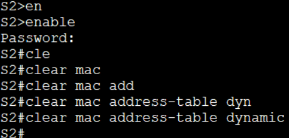 
#### b.	Снова быстро введите команду show mac address-table. 
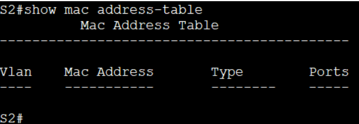   
#### Указаны ли в таблице МАС-адресов адреса для VLAN 1? Указаны ли другие МАС-адреса?  
#### Нет, не указаны. Он пустой.  
#### Через 10 секунд введите команду **show mac address-table** и нажмите клавишу ввода.  
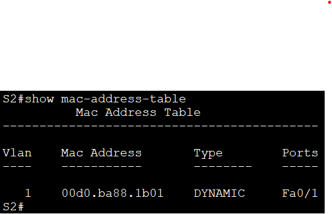 
#### Появились ли в таблице МАС-адресов новые адреса? 
#### Снова отображается старый MAC-адрес.  

### **Шаг 4. С компьютера PC-B отправьте эхо-запросы устройствам в сети и просмотрите таблицу МАС-адресов коммутатора.** 
#### a.	На компьютере PC-B откройте командную строку и еще раз введите команду **arp -a**.  
  
#### Не считая адресов многоадресной и широковещательной рассылки, сколько пар IP- и МАС-адресов устройств было получено через протокол ARP?  
#### 3 пары: для каждого устройства в сети без PC-B.  
#### b.	Из командной строки PC-B отправьте эхо-запросы на компьютер PC-A, а также коммутаторы S1 и S2.   
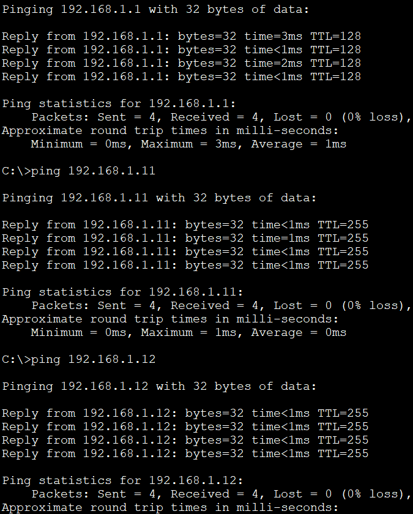  
#### От всех ли устройств получены ответы? 
#### Да. От всех устройств получены ответы. 
#### c.	Подключившись через консоль к коммутатору S2, введите команду **show mac address-table**.  
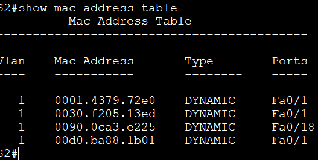   
#### Добавил ли коммутатор в таблицу МАС-адресов дополнительные МАС-адреса? Если да, то какие адреса и устройства?  
#### На коммутаторе S1 имеются MAC-адреса обоих ПК и интерфейсов Fa0/1 и Vlan1. 
#### На компьютере PC-B откройте командную строку и еще раз введите команду arp -a.  
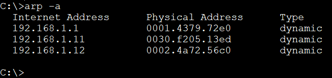   
#### Появились ли в ARP-кэше компьютера PC-B дополнительные записи для всех сетевых устройств, которым были отправлены эхо-запросы?   
#### Указаны IP и MAC адреса всех устройств в сети. 

###	**Вопрос для повторения** 
#### В сетях Ethernet данные передаются на устройства по соответствующим МАС-адресам. Для этого коммутаторы и компьютеры динамически создают ARP-кэш и таблицы МАС-адресов. Если компьютеров в сети немного, эта процедура выглядит достаточно простой. Какие сложности могут возникнуть в крупных сетях?  
#### Слишком большое количество ARP-запросов может замедлить работу всей сети.  
 

