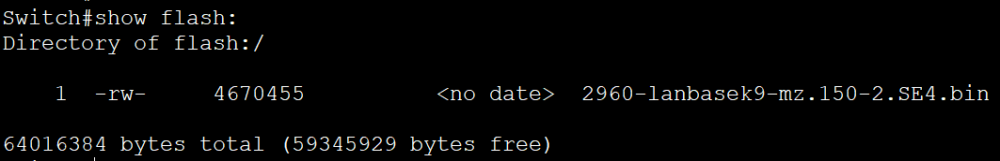
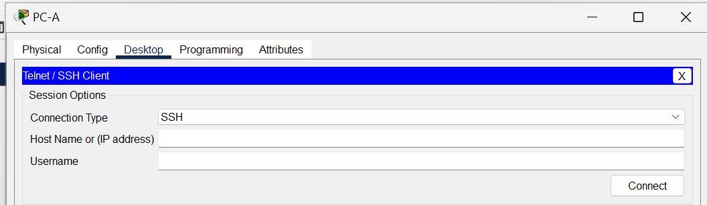

# Лабораторная работа. Базовая настройка коммутатора.
## **Задачи**
### **Часть 1. Проверка конфигурации** коммутатора по умолчанию
### **Часть 2. Создание сети и настройка основных параметров устройства**
+ •	Настройте базовые параметры коммутатора.
+ •	Настройте IP-адрес для ПК.
### **Часть 3. Проверка сетевых подключений**
+ •	Отобразите конфигурацию устройства.
+ •	Протестируйте сквозное соединение, отправив эхо-запрос.
+ •	Протестируйте возможности удаленного управления с помощью Telnet.

### **Часть 1. Создание сети и проверка настроек коммутатора по умолчанию** 
#### **Шаг 1. Создайте сеть согласно топологии**
#### a.	Подсоедините консольный кабель, как показано в топологии. На данном этапе не подключайте кабель Ethernet компьютера PC-А

#### b.	Установите консольное подключение к коммутатору с компьютера PC-A с помощью Tera Term или другой программы эмуляции терминала.

#### **Вопросы:**
#### 1. Почему нужно использовать консольное подключение для первоначальной настройки коммутатора?
#### Консольное подключение используется потому, что это единственный способ "поговориить" с "голым" сетевым устройством, который не зависит от его сетевой конфигурации, надежен и предоставляет доступ ко всем низкоуровневым функциям, необходимым для первоначальной настройки и аварийного восстановления.

#### **2. Почему нельзя подключиться к коммутатору через Telnet или SSH?**
#### Изначально не настроен IP-адрес на вмртуальном интерфейсе (SVI).

#### **Шаг 2. Проверьте настройки коммутатора по умолчанию.**
#### a. Введите команду **enable**, чтобы войти в привилегированный режим EXEC.

#### Убедитесь, что на коммутаторе находится пустой файл конфигурации по умолчанию, с помощью команды **show running-config** привилегированного режима EXEC.
#### b.	Изучите текущий файл running configuration.
#### Сколько интерфейсов FastEthernet имеется на коммутаторе 2960?
#### Ответ: 24 интерфейса.
#### Сколько интерфейсов Gigabit Ethernet имеется на коммутаторе 2960?
#### Ответ: 2 интерфейса.
#### Каков диапазон значений, отображаемых в vty-линиях?
#### Ответ: От 0 до 15.

#### c.	Изучите файл загрузочной конфигурации (startup configuration), который содержится в энергонезависимом ОЗУ (NVRAM).

#### Почему появляется это сообщение?
#### Отыет: Потому, что никто ещё не делал запись конфига.

#### d.	Изучите характеристики SVI для VLAN 1.
#### Назначен ли IP-адрес сети VLAN 1?
#### Ответ: Нет, не назначен.
#### Какой MAC-адрес имеет SVI? Возможны различные варианты ответов.
#### Ответ: MAC-адрес виртуального интерфейса коммутатора (SVI) может быть разным и зависит от конкретной конфигурации. В данном случае MAC адрес000c.cfa0.1c78 (bia 000c.cfa0.1c78) 

#### Данный интерфейс включен?
#### Ответ: Данный интрефейс выключен.

#### e.	Изучите IP-свойства интерфейса SVI сети VLAN 1.
#### Какие выходные данные вы видите?
 
#### в VLAN 1 не назначен порт, который находится в рабочем состоянии

#### f.	Подсоедините кабель Ethernet компьютера PC-A к порту 6 на коммутаторе и изучите IP-свойства интерфейса SVI сети VLAN 1.

#### Какие выходные данные вы видите?
#### 

#### g.	Изучите сведения о версии ОС Cisco IOS на коммутаторе.
#### Под управлением какой версии ОС Cisco IOS работает коммутатор?

#### Как называется файл образа системы?

#### h.	Изучите свойства по умолчанию интерфейса FastEthernet, который используется компьютером PC-A.
   
#### Интерфейс включен или выключен?
#### Включен.
#### Что нужно сделать, чтобы включить интерфейс?
#### Нужно выполнить команду no shutdown
#### Какой MAC-адрес у интерфейса?
####    
#### Какие настройки скорости и дуплекса заданы в интерфейсе?
   

#### i.	Изучите флеш-память
#### Выпонить команду show flash либо dir flash
   

## **Часть 2. Настройка базовых параметров сетевых устройств**
### **Шаг 1. Настройте базовые параметры коммутатора.**
#### a. В режиме глобальной конфигурации настроить базовые параметры конфигурации
 
#### b.	Назначьте IP-адрес интерфейсу SVI на коммутаторе
    

#### c. Доступ через порт консоли также следует ограничить с помощью пароля.
    

#### d.	Настройте каналы виртуального соединения для удаленного управления (vty), чтобы коммутатор разрешил доступ через Telnet.
   
#### Для чего нужна команда login?
#### Чтобы ввести пароль в действие.

### Шаг 2. Настройте IP-адрес на компьютере PC-A.
  

## **Часть 3. Проверка сетевых подключений**
### Шаг 1. Отобразите конфигурацию коммутатора
#### a. Конфигурация приведена ниже.
S1#show run  

Building configuration...  

Current configuration : 1270 bytes  

!  
version 15.0  
no service timestamps log datetime msec  
no service timestamps debug datetime msec  
service password-encryption  
!    
hostname S1    
!
enable secret 5 $1$mERr$9cTjUIEqNGurQiFU.  ZeCi1  
!  
!  
!  
no ip domain-lookup  
!  
!  
!  
spanning-tree mode pvst  
spanning-tree extend system-id  
!  
interface FastEthernet0/1  
!
interface FastEthernet0/2  
!
interface FastEthernet0/3  
!
interface FastEthernet0/4  
!  
interface FastEthernet0/5  
!
interface FastEthernet0/6  
!  
interface FastEthernet0/7  
!  
interface FastEthernet0/8  
!  
interface FastEthernet0/9  
!  
interface FastEthernet0/10  
!  
interface FastEthernet0/11  
!  
interface FastEthernet0/12  
!  
interface FastEthernet0/13  
!  
interface FastEthernet0/14  
!  
interface FastEthernet0/15  
!  
interface FastEthernet0/16  
!  
interface FastEthernet0/17  
!  
interface FastEthernet0/18  
!  
interface FastEthernet0/19  
!  
interface FastEthernet0/20  
!  
interface FastEthernet0/21  
!
interface FastEthernet0/22  
!  
interface FastEthernet0/23  
!  
interface FastEthernet0/24  
!  
interface GigabitEthernet0/1  
!  
interface GigabitEthernet0/2  
!  
interface Vlan1  
 ip address 192.168.1.2 255.255.255.0  
!  
banner motd ^CUnauthorized access is strictly prohibited.^C  
!  
!  
!  
line con 0  
 password 7 0822455D0A16  
 login  
!  
line vty 0 4  
 password 7 0822455D0A16  
 login  
line vty 5 15  
 login  
!  
!  
!  
!  
end  
#### b.	Проверьте параметры VLAN 1
  

#### Какова полоса пропускания этого интерфейса?
#### 100000 Kbit/s  

### **Шаг 2. Протестируйте сквозное соединение, отправив эхо-запрос.**  
#### a.	В командной строке компьютера PC-A с помощью утилиты ping проверьте связь сначала с адресом PC-A.  
    

### b.	Из командной строки компьютера PC-A отправьте эхо-запрос на административный адрес интерфейса SVI коммутатора S1.  
  

### **Шаг 3. Проверьте удаленное управление коммутатором S1**  
#### a.	Откройте Tera Term или другую программу эмуляции терминала с возможностью Telnet.  
  

#### b.	Выберите сервер Telnet и укажите адрес управления SVI для подключения к S1.  Пароль: **cisco**.  
  

#### c.	После ввода пароля **cisco** вы окажетесь в командной строке пользовательского режима. Для перехода в исполнительский режим EXEC введите команду **enable** и используйте секретный пароль **class**.  
  

#### d.	Сохраните конфигурацию.  
     

#### e.	Чтобы завершить сеанс Telnet, введите **exit**    
           

## 	**Вопросы для повторения**
#### **1.	Зачем необходимо настраивать пароль VTY для коммутатора?**   
#### Настройка пароля VTY для коммутатора Cisco необходима, чтобы ограничить доступ к устройству через протокол Telnet.

#### **2.	Что нужно сделать, чтобы пароли не отправлялись в незашифрованном виде?**    
#### Чтобы пароли в устройствах Cisco не отправлялись в незашифрованном виде, нужно активировать функцию шифрования паролей.   

